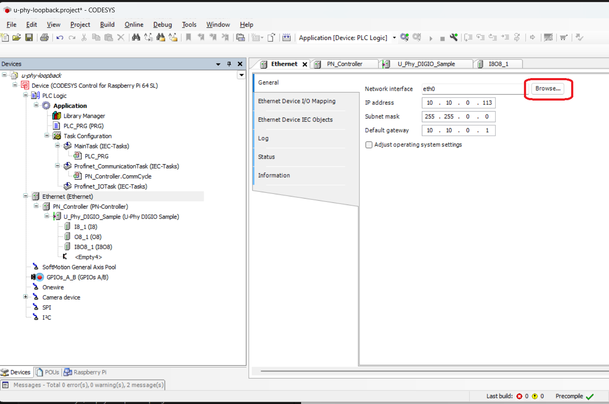
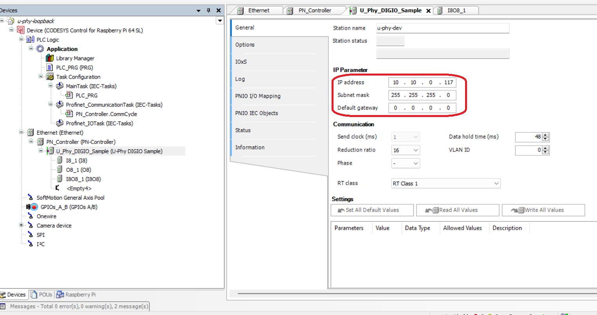
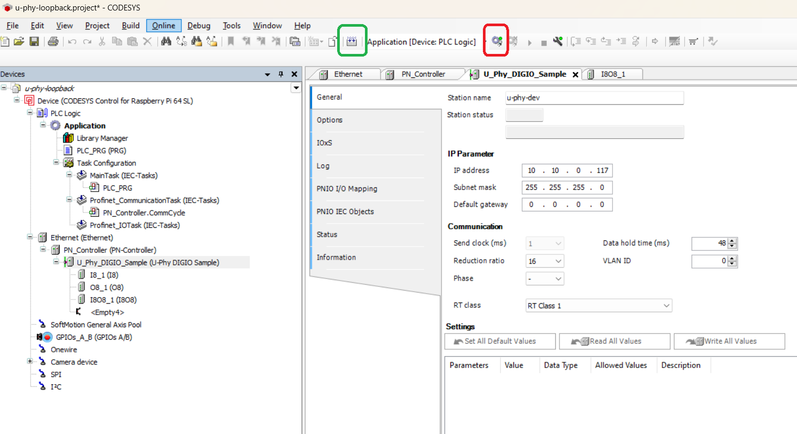
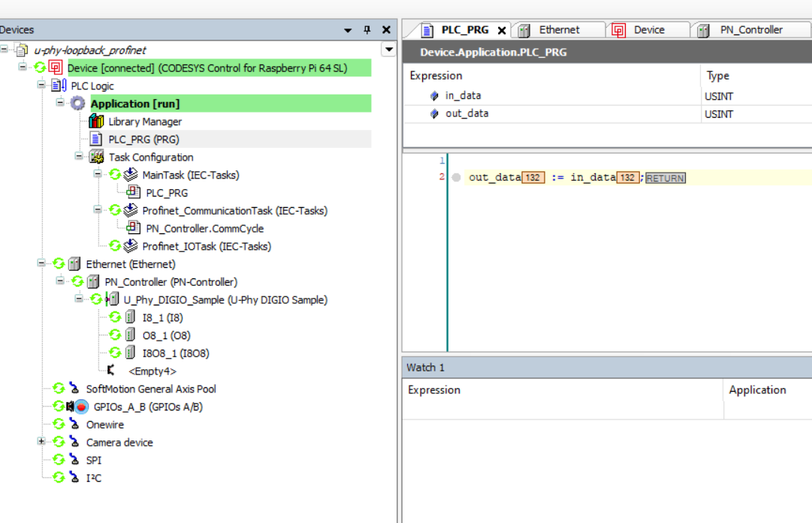
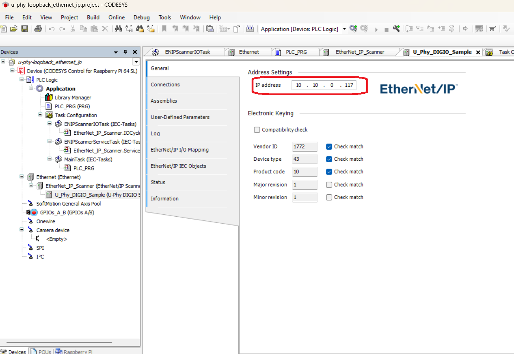

# RT-Labs U-Phy Demo


[U-Phy](https://rt-labs.com/u-phy/) provides one single and unified API for all fieldbuses. 

This demo package provides a small demo application & single library built for XMC72_EVK supporting following fieldbuses.

- Profinet 
- EthernetIP

```
 Demo device model 
   -- 8 bit output (read only)
   -- 8 bit input (write only)
   -- 8 bit output/input (rw)
```

By default profinet stack is started

Included demo project will start a profinet device which will showcase a small data loopback towards a codesys PLC application .

U-Phy continuously increments the 8 bit input value which the PLC will 'echo' to the 8 bit output value.

*Note : this demo application is based on infineons UDP Ethernet Server example app.*

To startup U-Phy using Ethernet IP please modify main.c

```
/* configure runmode */
#define UPHY_DEFAULT_MODE UPHY_RUNMODE_ETHERNET_IP
```

## Building demo project in Modus Toolbox

1. Start modus toolbox 3.1 (Eclipse IDE)
2. New application -> KIT_XMC72_EVK -> Getting Started -> RT-Labs Demo
3. Build project 
4. Launch RT-Labs Demo onto XMC72_EVK using 'RT-Labs_Demo Program (KitProg3_MiniProg4)' launch target.

## Find locally assigned IP address

Open serial terminal to find out DHCP assigned IP address of board (or set static IP address in udp_server.h if preferred).

Alternatively, specify a static ip address in proj_root/source/udp_server.h

```
Ethernet connection manager initialized.
Successfully connected to Ethernet.
IP Address Assigned: 10.10.0.117
Starting sample application
      9045 [INFO ] Enable events and poll event status
      9045 [INFO ] Add device configuration to U-Phy Core
      9045 [INFO ]   Device:  U-Phy DIGIO Sample
      9047 [INFO ]   Bus:     Profinet
      9051 [INFO ] Add device "U-Phy DIGIO Sample"
      9055 [INFO ]   Serial number:       "1234"
      9060 [INFO ]   Web server:       "Enabled"
      9064 [INFO ]   Number of slots:     3
      9068 [INFO ]   Slot[0]: I8
      9071 [INFO ] Add slot 0 "I8" in_signals:1 out_signals:0 parameters:0
      9077 [INFO ]   Add input signal 0 "Input 8 bits" UINT8 offset:0 n_bits:8
      9084 [INFO ]   Slot[1]: O8
      9087 [INFO ] Add slot 1 "O8" in_signals:0 out_signals:1 parameters:0
      9094 [INFO ]   Add output signal 0 "Output 8 bits" UINT8 offset:0 n_bits:8
      9101 [INFO ]   Slot[2]: I8O8
      9104 [INFO ] Add slot 2 "I8O8" in_signals:1 out_signals:1 parameters:1
      9111 [INFO ]   Add input signal 0 "Input 8 bits" UINT8 offset:1 n_bits:8
      9118 [INFO ]   Add output signal 0 "Output 8 bits" UINT8 offset:1 n_bits:8
      9125 [INFO ]   Add param 0 "Parameter 1" dtype:5 n_bits:32 flags:0
      9131 [INFO ] Add bus config
      9134 [INFO ] Activate configuration
      9138 [INFO ] Activate configuration
      9141 [INFO ] Start profinet
      9144 [INFO ] Profinet configuration
      9148 [INFO ]   P-Net version:        0.2.0
      9152 [INFO ]   Max number of slots:  5 (incl slot for DAP module)
      9159 [INFO ]   PUL log level:        5 (range VERBOSE=0 to FATAL=5)
      9165 [INFO ]   Max number of ports:  2
      9169 [INFO ]   Network interfaces:   enxc4411e82f6d4
      9174 [INFO ]   Default station name: u-phy-dev
      9179 [INFO ]   Min device interval:  32 (in units of 31.25 us)
      9185 [INFO ]   Vendor ID:            0x0493
      9189 [INFO ]   Device ID:            0x0003
      9193 [INFO ]   Product name:         U-Phy DIGIO Sample
      9199 [INFO ]   Order ID:             MOD01
      9203 [INFO ]   Profile ID:           0x0000
      9207 [INFO ]   Profile specific type:0x0000
      9212 [INFO ]   Software revision:    0.1.27 V
      9216 [INFO ]   Hardware revision:    1
      9223 [INFO ] Status: 0x0002 [-|CONFIGURED|-]
      9225 [INFO ] Configuration activated
      9229 [INFO ] Status: 0x0003 [-|CONFIGURED|CONNECTED]
      9334 [INFO ] Core status: 0x0003 [-|CONFIGURED|CONNECTED]
      9334 [INFO ] Configuration activated
      9334 [INFO ] Enable watchdog
      9335 [INFO ] Enable watchdog
      9785 [INFO ] Status: 0x0007 [RUNNING|CONFIGURED|CONNECTED]
      9785 [INFO ] Core status: 0x0007 [RUNNING|CONFIGURED|CONNECTED]
```

*Note : before PLC is connected output will always stay at 0*

## Installing Raspberry PI 4

<div style="border: 1px solid black; padding: 10px;font-family: Consolas">

1. Download and install Raspberry Pi Imager from https://www.raspberrypi.com/software/

2. Start Raspberry Pi Imager

3. In the Select OS dialog choose 'Raspberry Pi OS (64 bit)'

4. Choose storage, select sdcard

5. Press Next

6. Edit Settings

7. Ensure wireless LAN is not checked.

8. Set hostname to something unique on local network e.g. 'codesys' or similar

9. Set username and password (for ssh login from codesys)

10. Save

11. Press Y when asked to erase all data on media

12. Once completed eject sdcard and insert into Rpi4

13. Power up raspberry pi

14. Find DHCP assigned IP address ```ping -4 <hostname>.local``` 
    from a windows command prompt. This IP address will be required when setting up codesys.

C:\Projects\Infineon\uphy_demo_package>ping -4 codesys

Pinging codesys.local [10.10.0.113] with 32 bytes of data:
Reply from 10.10.0.113: bytes=32 time=1ms TTL=64
Reply from 10.10.0.113: bytes=32 time=1ms TTL=64

15.  Verify SSH login works 'ssh user@ip_address
</div>

## Installing codesys

<div style="border: 1px solid black; padding: 10px;font-family: Consolas">

Full instructions for reference (signup & login required)

[Downloading-and-installing-codesys-development-system-on-a-windows-pc](https://docs.rt-labs.com/p-net/using_codesys.html#downloading-and-installing-codesys-development-system-on-a-windows-pc) 

1. Downloading and installing Codesys Development System on a Windows PC. The program can be downloaded from https://store.codesys.com/codesys.html. A trial version is available. Registration is required.

2. Download “CODESYS Development System V3”, in the latest available version. The file is named CODESYS 64 <VERSION>.exe.

3. Install it on a Windows machine by double clicking the icon.

4. From within Codesys, install the “Codesys control for Raspberry Pi” by using the menu Tools ‣ Codesys installer.

5. In the AddOns section use Browse and search for “raspberry”.

6. Select the relevant row in the results, and click Install. When completed, there should be an entry Update Raspberry Pi available in the Tools menu.

7. Restart the program after the installation.

</div>

## Installing Raspberry Pi Runtime


<div style="border: 1px solid black; padding: 10px;font-family: Consolas">

1. In Codesys on Windows, use the menu Tools “Update Raspberry Pi”. 

2. Enter IP address of device under 'Select target'. (Scan button may work to detect the Rpi4 but often hangs  for several minutes and is not always finding the device using this method it is better to manually specify the IP address)

3. Enter ssh login credentials chosen during RPi OS installation.


4. Under 'CODESYS Runtime Package'press Install button to install the required runtime files onto RPi4.

5. Use “Standard” runtime in the pop-up window.

6. Press Runtime -> Start to activate runtime on Rpi4.

When asked to setup user credentials for runtime please select something simple such as 

login : rt
passwd : rt

</div>


## U-Phy codesys demo project - Profinet

```
File --> Open Project --> uphy_demo_package/codesys/u-phy-loopback_profinet.project
```
### Adjust codesys project network settings to match local network



* Press Devices tab next to Raspberry Pi tab.
* In the device tree press Ethernet (Ethernet) -> Browse
* When asked for username / password select the login credentions created in the step above where raspberry pi runtime was installed onto raspberry pi (see above). Note : this is not the same as ssh login credentials (unless same was used in both places).


* Select interface matching raspberry pi ip address (typically eth0)


### Set U_Phy_DIGIO_Sample network settings (Profinet)



* Configure IP address of XMC72_EVK running U-Phy Demo application

### Start Codesys PLC application



* Press green marked button to compile PLC application7
* Press red marked button to upload PLC application to Rpi runtime and press Yes in dialogue box.


* Press "play" button 
  


### Verify PLC application running


You should now see that in the xmc72 console that output value is updated and one step behind the input value. In each datacycle xmc72 will increment current 8-ibt input value and in the next cycle the codesys plc would have "echoed" the value back via the 8 bit output value.

```
757040 [INFO ] Status: 0x0007 [RUNNING|CONFIGURED|CONNECTED]
757040 [INFO ] Core status: 0x0007 [RUNNING|CONFIGURED|CONNECTED]
set input data to 1 (out is now 0)
set input data to 2 (out is now 1)
```

The codesys application should now show green status on all entities in the device tree.


* Click PLC_PRG tab and verify data input & output increments



* In each data cycle the input value is updated and in the next that value would be "echoed" into the output value. Hence input value on U-Phy console log will always be one step higher than the output.


## U-Phy codesys demo - Ethernet IP


To startup U-Phy using Ethernet IP please modify main.c, recompile and launch.

 ```
/* configure runmode */
#define UPHY_DEFAULT_MODE UPHY_RUNMODE_ETHERNET_IP
 ```

Open below project in codesys.


```
File --> Open Project --> uphy_demo_package/codesys/u-phy-loopback_ethernet_ip.project
```

### Adjust codesys project network settings to match local network


* Press Devices tab next to Raspberry Pi tab.
* In the device tree press Ethernet (Ethernet) -> Browse
* When asked for username / password select the login credentions created in the step above where raspberry pi runtime was installed onto raspberry pi (see above). Note : this is not the same as ssh login credentials (unless same was used in both places).
* Select interface matching raspberry pi ip address (typically eth0)


### Set U_Phy_DIGIO_Sample network settings (EthernetIP)



* Configure IP address of XMC72_EVK running U-Phy Demo application

### Start Codesys PLC application

* Same steps as for profinet, please see above.

### Verify PLC application running

* Same steps as for profinet, please see above.
